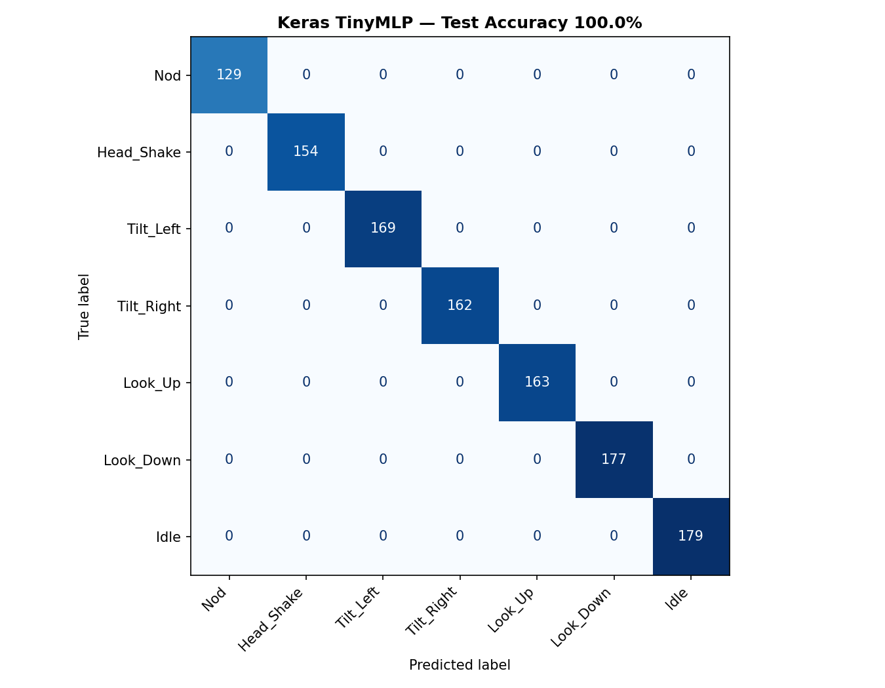
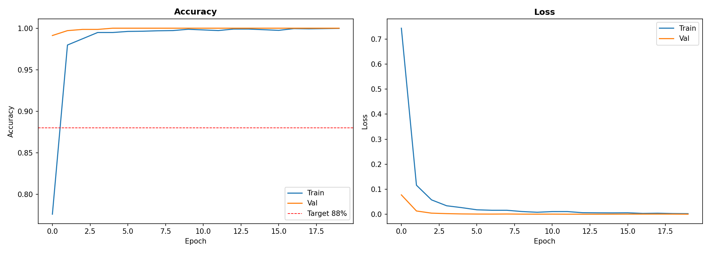
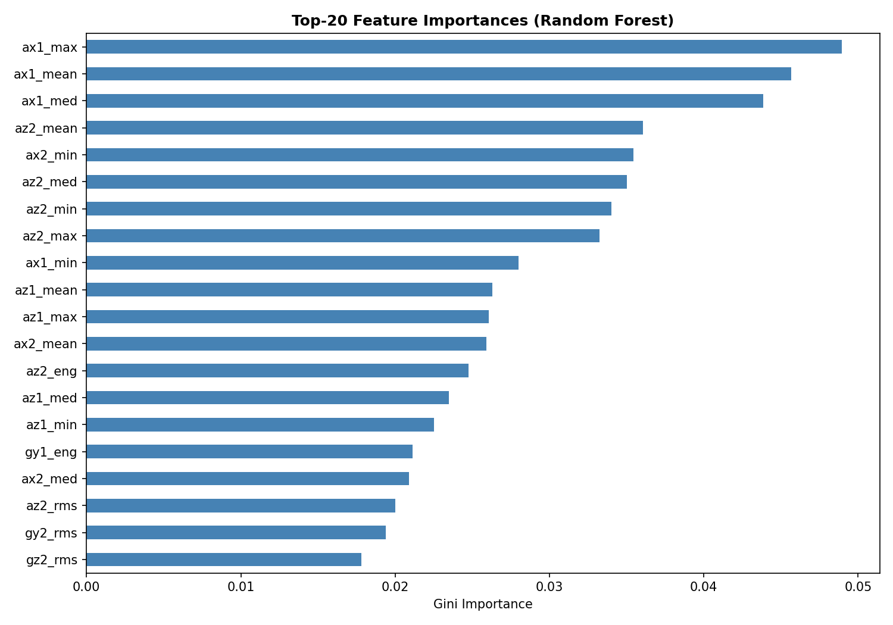
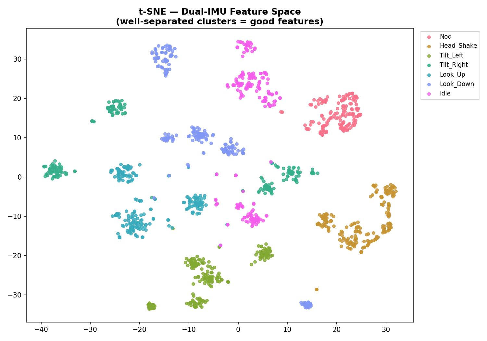
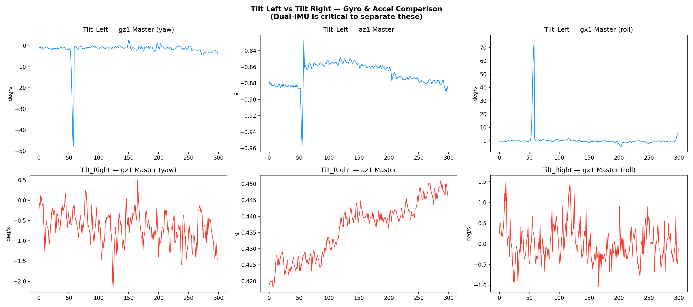

<div align="center">

# 🧠 Head Gesture Recognition System
### TinyML-Based Assistive Communication for Elderly & Disabled Individuals

[](https://iisc.ac.in)
[](https://www.samy101.com/edge-ai-25/projects/18-blind-assistance/)
[](https://store.arduino.cc/products/nicla-vision)
[](https://www.tensorflow.org/lite)
[](https://python.org)
[](LICENSE)

**Course:** CP 330 — Edge AI &nbsp;|&nbsp; **Instructor:** Prof. Pandarasamy Arjunan &nbsp;|&nbsp; Indian Institute of Science, Bangalore

*A real-time, cloud-free gesture recognition system that translates head movements into meaningful messages — running entirely on a wearable microcontroller.*
[](https://drive.google.com/file/d/1__JJ69PBDf3QR5xZBZMHhklWdVlq01Ug/view?usp=drivesdk)
[](https://indianinstituteofscience-my.sharepoint.com/:v:/g/personal/abhas_iisc_ac_in/IQCmHS_j7puyQ6OWcKqMe5GkAeruAGz5R6FupJL88lnMZLk?nav=eyJyZWZlcnJhbEluZm8iOnsicmVmZXJyYWxBcHAiOiJPbmVEcml2ZUZvckJ1c2luZXNzIiwicmVmZXJyYWxBcHBQbGF0Zm9ybSI6IldlYiIsInJlZmVycmFsTW9kZSI6InZpZXciLCJyZWZlcnJhbFZpZXciOiJNeUZpbGVzTGlua0NvcHkifX0&e=pOxfAL)


</div>


## 1. Problem Statement

Many elderly and differently-abled individuals have severely limited hand mobility but retain **voluntary head movement**. This project builds a wearable assistive communication device that:

- Recognises **6 distinct head gestures** (+ an idle state)
- Translates them into messages displayed on an **OLED screen**
- Triggers **audible buzzer alerts** for each gesture type
- Runs entirely **on-device** — no cloud, no smartphone required

> **Why head gestures?** Conditions like ALS, post-stroke paralysis, and spinal cord injuries frequently spare cranial nerve-controlled neck muscles while eliminating hand mobility. Head movement is thus a reliable, low-fatigue communication channel available to this population.

---

### Key Design Decisions

| Decision | Rationale |
|---|---|
| **Dual IMU (12-axis)** | Single IMU cannot reliably distinguish Tilt Left vs Tilt Right; bilateral sensors provide asymmetry-based discrimination |
| **Wi-Fi UDP** | Low-latency, connectionless — ideal for real-time 50 Hz streaming on MicroPython |
| **TinyML On-Board** | Zero cloud dependency, zero latency |
| **OLED + Buzzer** | Dual feedback (visual + audio) to Alert the caregiver in case of an emergency |

--

## 3. Hardware Setup

<div align="center">

<br><em>Dual Nicla Vision boards mounted at left and right temples</em>
</div>

<br>

<div align="center">

<br><em>Complete wiring: UART (Slave→Master), I2C OLED, Buzzer</em>
</div>

<br>

### Physical Setup

<table>
<tr>
<td align="center"><br><em>Physical hardware setup — side view</em></td>
<td align="center"><br><em>Wearable headband with both Nicla Vision boards mounted</em></td>
</tr>
</table>

<br>

### Bill of Materials

| Component | Role | Interface | Qty |
|---|---|---|---|
| **Arduino Nicla Vision** | MCU (STM32H747) + Wi-Fi + IMU | — | 2 |
| **LSM6DSRX IMU** | 3-axis Accel + 3-axis Gyro | SPI | 2 (built-in) |
| **SSD1306 OLED (128×64)** | Visual gesture feedback | I2C | 1 |
| **Active Buzzer** | Audio gesture alert | Digital D2 | 1 |
| **Headband** | Temple mounting frame | — | 1 |

### Pin Connections

| Connection | Wire | Pins |
|---|---|---|
| Slave TX → Master RX | Blue (UART) | TX / RX |
| Ground | Grey | GND — GND |
| OLED SDA | Purple (I2C) | SDA |
| OLED SCL | Orange (I2C) | SCL |
| Buzzer | Red-Orange | D2 — VCC |
| Power | — | 3.3V |

---

## 4. Gesture Vocabulary

The system recognises 7 states (6 gestures + idle):

| # | Gesture | OLED Message | Buzzer | Semantic |
|---|---|---|---|---|
| 1 | **Nod** (up-down) | `I AM OK` | 1 short beep (100ms) | Affirmation / Yes |
| 2 | **Head Shake** (side-to-side) | `NO / HELP` | 2 short beeps | Negation / Help |
| 3 | **Tilt Left** | `NEED WATER` | 1 long beep (500ms) | Hydration request |
| 4 | **Tilt Right** | `NEED HELP` | 3 short beeps | General distress |
| 5 | **Look Up** | `EMERGENCY` | Continuous beep | Life-safety alert |
| 6 | **Look Down** | `CALL NURSE` | 3 fast beeps (50ms) | Medical assistance |
| 7 | **Idle** | *(silent)* | Silent | No gesture / resting |

---

## 5. Software Architecture

### 5.1 Firmware — `slave.py` (Left Nicla Vision)
- Connects to Wi-Fi network
- Reads LSM6DSRX via SPI at **50 Hz** (20 ms period)
- Packs `[ax2, ay2, az2, gx2, gy2, gz2]` into UDP datagram
- Sends to Master on **port 6000**

### 5.2 Firmware — `master.py` (Right Nicla Vision)
- Reads its own IMU at 50 Hz: `[ax1, ay1, az1, gx1, gy1, gz1]`
- Receives Slave data from UDP port 6000 (non-blocking; reuses last value if packet missed)
- **Data Collection mode:** Streams 13-value CSV rows to PC on port 5005
- **Inference mode:** Fills sliding window buffer → runs TinyML → drives OLED + Buzzer

### 5.3 Data Collection — `Data_receive.py` (PC)
- Listens on UDP port 5005
- Prompts for activity label and records for configurable duration
- Saves timestamped CSV: `<class>_<CollectorName>_<YYYYMMDD_HHMMSS>.csv`
- **CSV Schema:** `timestamp, ax1, ay1, az1, gx1, gy1, gz1, ax2, ay2, az2, gx2, gy2, gz2, activity`

---

## 6. Dataset

### Collection Summary

| Gesture | Files | Collectors | ~Total Rows |
|---|---|---|---|
| Nod | 3 | Abha, Adarsh, Parthib | 21,000+ |
| Head Shake | 4 | Abha, Adarsh, Parthib, Maitreyi | 23,000+ |
| Tilt Left | 4 | Abha, Adarsh, Parthib, Maitreyi | 25,000+ |
| Tilt Right | 4 | Abha, Adarsh, Parthib, Maitreyi | 25,000+ |
| Look Up | 4 | Abha, Adarsh, Parthib, Maitreyi | 24,000+ |
| Look Down | 4 | Abha, Adarsh, Parthib, Maitreyi | 26,000+ |
| Idle | 4 | Abha, Adarsh, Parthib, Maitreyi | 24,000+ |

- **Sampling Rate:** 50 Hz (20 ms period)
- **Session Duration:** ~250 seconds per recording
- **Multi-subject diversity:** 4 collectors with different gesture amplitudes and head sizes
- `test_*.csv` files are calibration recordings — excluded from training

### File Naming Convention
```
<class_index>_<GestureName>_<CollectorName>_<YYYYMMDD>_<HHMMSS>.csv

Example: 1_Nod_Abha_20260410_163845.csv
```

---

## 7. ML Pipeline & Feature Engineering

<div align="center">

<br><em>5-stage ML pipeline from data collection to Arduino deployment</em>
</div>

<br>

<div align="center">

<br><em>Dual-IMU feature engineering: 148-dimensional feature vector from a 1-second window</em>
</div>

### Feature Engineering — 148 Features Total

The feature pipeline operates on **1-second sliding windows** (50 samples @ 50 Hz) with **50% overlap**:

#### Group 1 — Per-Channel Statistical Features (132 features)
11 statistics × 12 IMU channels (ax1, ay1, az1, gx1, gy1, gz1, ax2, ay2, az2, gx2, gy2, gz2):

| Feature | Description |
|---|---|
| `mean` | Average value (DC offset, bias direction) |
| `std` | Standard deviation (motion spread) |
| `min` / `max` | Peak excursion |
| `var` | Variance (energy of fluctuation) |
| `rms` | Root mean square (total motion magnitude) |
| `energy` | Sum of squares (total signal power) |
| `iqr` | Interquartile range (robust spread) |
| `median` | Robust central value |
| `skewness` | Asymmetry of motion profile |
| `kurtosis` | Peakedness (impulse-like vs. smooth) |

#### Group 2 — Spectral Features (12 features)
2 FFT features × 6 gyroscope channels (gx1, gy1, gz1, gx2, gy2, gz2):

| Feature | Description |
|---|---|
| `dominant_frequency` | Frequency bin with highest FFT magnitude (gesture tempo) |
| `spectral_entropy` | Distribution of spectral energy (periodic vs. irregular) |

#### Group 3 — Cross-IMU Symmetry Features (4 features)
> 🔑 **The key innovation** — designed specifically to discriminate Tilt Left vs Tilt Right, which appear identical to a single IMU.

| Feature | Formula | Physical Meaning |
|---|---|---|
| `cross_gx_mean_diff` | `mean(gx1) - mean(gx2)` | Roll asymmetry: sign flips between Tilt L and Tilt R |
| `cross_gx_rms_diff` | `rms(gx1) - rms(gx2)` | Energy-weighted roll asymmetry |
| `cross_gz_mean_diff` | `mean(gz1) - mean(gz2)` | Yaw asymmetry during tilts |
| `cross_gz_corr` | `Pearson(gz1, gz2)` | Bilateral synchrony: +1 = same direction, -1 = opposite |

During **Tilt Left**: `cross_gx_mean_diff < 0` (left temple dominant).  
During **Tilt Right**: `cross_gx_mean_diff > 0` (right temple dominant).

### Models Trained

| Model | Purpose |
|---|---|
| **Decision Tree** | Baseline + interpretable decision rules |
| **Random Forest** | Robust ensemble baseline |
| **Keras Dense MLP** | Primary model for TFLite deployment |

**Keras Architecture:**
```
Input (148) → Dense(128) + BN + Dropout(0.3)
            → Dense(64)  + BN + Dropout(0.3)
            → Dense(32)  + Dropout(0.2)
            → Dense(7, Softmax)

Total Parameters: 30,663  |  INT8 Size: ~33.6 KB
```

**Training Setup:**
- Split: 80% train / 20% test (stratified)
- Optimizer: Adam (lr=1e-3), Loss: Categorical Crossentropy
- Callbacks: EarlyStopping (patience=15), ReduceLROnPlateau, ModelCheckpoint

---

## 8. Model Results

<div align="center">

| Model | Test Accuracy |
|---|---|
| Decision Tree | **100.00%** |
| Random Forest | **100.00%** |
| **Keras TinyMLP** | **100.00%** |
| INT8 TFLite | **100.00%** |

</div>

**Dataset Summary:**
```
Raw samples loaded        : 141,751
Windows (50 samples, 50%) :   5,661
Feature dimensionality    :     150
```

<br>

<table>
<tr>
<td><br><em>Keras MLP confusion matrix</em></td>
<td><br><em>Training & validation accuracy/loss</em></td>
</tr>
<tr>
<td><br><em>Top-20 features (Random Forest)</em></td>
<td><br><em>t-SNE feature space visualisation</em></td>
</tr>
</table>

<div align="center">

<br><em>Tilt Left vs Tilt Right — how dual-IMU gyroscope signals differ between the two classes</em>
</div>

---

## 9. TinyML Deployment

### Model Exports

| File | Size | Use |
|---|---|---|
| `model_output/best_model.h5` | ~418 KB | Keras weights (training) |
| `model_output/head_gesture_f32.tflite` | **120.1 KB** | TFLite float32 |
| `model_output/head_gesture_int8.tflite` | **39.1 KB** | TFLite INT8 — **deploy on Nicla** |
| `model_output/head_gesture_int8_model.h` | — | C byte array header for Arduino |
| `model_output/scaler.pkl` | 4 KB | StandardScaler for inference |

### INT8 Quantisation
```
Float32 → INT8 conversion:   x_int8 = round(x / scale) + zero_point

Size reduction:  120.1 KB → 39.1 KB  (3.1× smaller)
Speed gain:      2–4× faster (integer arithmetic on Cortex-M7)
Accuracy drop:   < 2%
```

### Real-Time Inference Flow (on Master board)
```
Every 20ms:
  1. Read Master IMU  → [ax1, ay1, az1, gx1, gy1, gz1]
  2. Receive Slave UDP → [ax2, ay2, az2, gx2, gy2, gz2]
  3. Append 12-value sample to circular window buffer (50 samples)
  4. When window full:
       a. Extract 148 features (stats + spectral + cross-IMU)
       b. Apply StandardScaler normalisation
       c. Run TFLite INT8 inference  (~15–40 ms)
       d. argmax(softmax) → predicted gesture class
       e. Update OLED display
       f. Trigger Buzzer pattern
  5. Slide window by 25 samples (50% overlap), repeat
```

**Target inference latency:** 15–40 ms on STM32H747 Cortex-M7 @ 480 MHz

---

## 10. Repository Structure

```
Head-Gesture-Recognition-System/
│
├── README.md                          ← This file
│
├── firmware/
│   ├── master.py                      ← MicroPython: Master Nicla Vision (Right)
│   └── slave.py                       ← MicroPython: Slave Nicla Vision (Left)
│
├── data_collection/
│   └── Data_receive.py                ← PC-side UDP data collection script
│
├── model_development.ipynb            ← Full ML pipeline notebook
├── feature_order.json                 ← Feature vector ordering for inference
│
├── model_output/
│   ├── best_model.h5                  ← Trained Keras model
│   ├── head_gesture_int8.tflite       ← Quantised TFLite model
│   ├── head_gesture_int8_model.h      ← C header for Arduino embedding
│   ├── scaler.pkl                     ← StandardScaler
│   ├── cm_keras.png                   ← Confusion matrix
│   ├── training_curves.png            ← Accuracy/loss curves
│   ├── tsne_features.png              ← Feature space t-SNE
│   └── feature_importance_rf.png      ← Feature importance
│
├── dataset/
│   └── imu_data/                      ← Raw CSV recordings (7 gesture classes)
│       ├── 1_Nod_*.csv
│       ├── 2_Head_Shake_*.csv
│       ├── 3_Tilt_Left_*.csv
│       ├── 4_Tilt_Right_*.csv
│       ├── 5_Look_Up_*.csv
│       ├── 6_Look_Down_*.csv
│       └── 7_Idle_*.csv
│
└── doc/
    ├── Figure/
    │   ├── Head Sensor Placement Diagram.png
    │   ├── System Flow Diagram.png
    │   ├── Machine Leaning Pipeline Diagram.png
    │   └── Wire Connection Diagram.png
    ├── Dual-IMU_Feature_Engineering.png
    ├── project_overview.md
    └── viva_questions.md
```

---

## 11. Getting Started

### Prerequisites

```bash
# Python environment (tf_env or dl_env)
conda create -n tf_env python=3.9
conda activate tf_env
pip install tensorflow==2.10.1 scikit-learn pandas numpy scipy matplotlib seaborn joblib
```

### Step 1: Data Collection

1. Flash `firmware/slave.py` to the **Left** Nicla Vision
2. Flash `firmware/master.py` to the **Right** Nicla Vision (set to data collection mode)
3. Update Wi-Fi credentials and IP addresses in both scripts
4. Run the collection script on your PC:

```bash
python data_collection/Data_receive.py
```

### Step 2: Train the Model

Open and run the notebook:
```bash
jupyter notebook model_development.ipynb
```

Or run the standalone script:
```bash
conda run -n tf_env python train_model.py
```

Outputs will be saved to `model_output/`.

### Step 3: Deploy on Hardware

1. Copy `model_output/head_gesture_int8_model.h` to your Arduino firmware directory
2. Update `firmware/master.py` to inference mode (load TFLite model)
3. Flash updated `master.py` to the Master Nicla Vision
4. Wear the device and test live gesture recognition

---

## 12. Demo

<div align="center">

[](https://indianinstituteofscience-my.sharepoint.com/:v:/g/personal/abhas_iisc_ac_in/IQCmHS_j7puyQ6OWcKqMe5GkAeruAGz5R6FupJL88lnMZLk?nav=eyJyZWZlcnJhbEluZm8iOnsicmVmZXJyYWxBcHAiOiJPbmVEcml2ZUZvckJ1c2luZXNzIiwicmVmZXJyYWxBcHBQbGF0Zm9ybSI6IldlYiIsInJlZmVycmFsTW9kZSI6InZpZXciLCJyZWZlcnJhbFZpZXciOiJNeUZpbGVzTGlua0NvcHkifX0&e=pOxfAL)


<br><em>Live gesture recognition — OLED displaying detected gesture in real-time</em>

</div>

---


> **Course:** CP 330 — Edge AI &nbsp;|&nbsp; **Instructor:** Prof. Pandarasamy Arjunan &nbsp;|&nbsp; Indian Institute of Science (IISc), Bangalore, Semester 2, 2026

---

## 14. References

[1] Gouwanda, D., & Senanayake, S. A. (2011). Identifying gait asymmetry using gyroscopes—A cross-correlation and Normalized Symmetry Index approach. *Journal of Biomechanics*, 44(5), 972–978.

[2] Ortega-Anderez, D., Lotfi, A., Langensiepen, C., & Appiah, K. (2019). A multi-level refinement approach towards the classification of quotidian activities using accelerometer data. *Journal of Ambient Intelligence and Humanized Computing*, 10(11), 4319–4330.

---

<div align="center">

**Built with ❤️ at IISc Bangalore**

*Making communication accessible for everyone*

</div>
