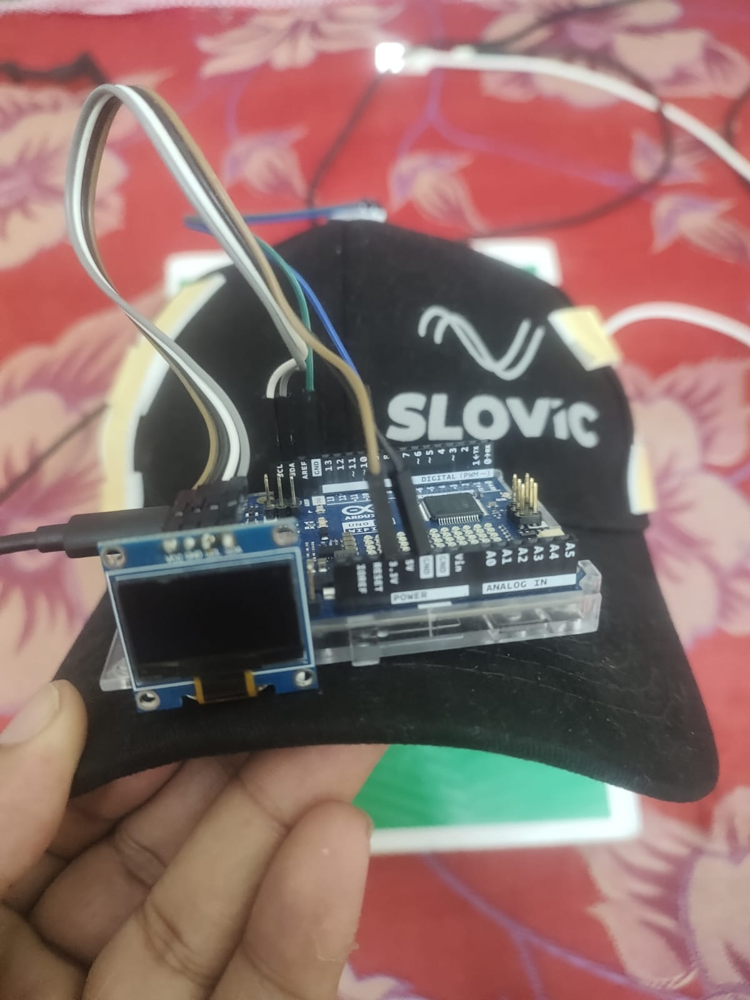
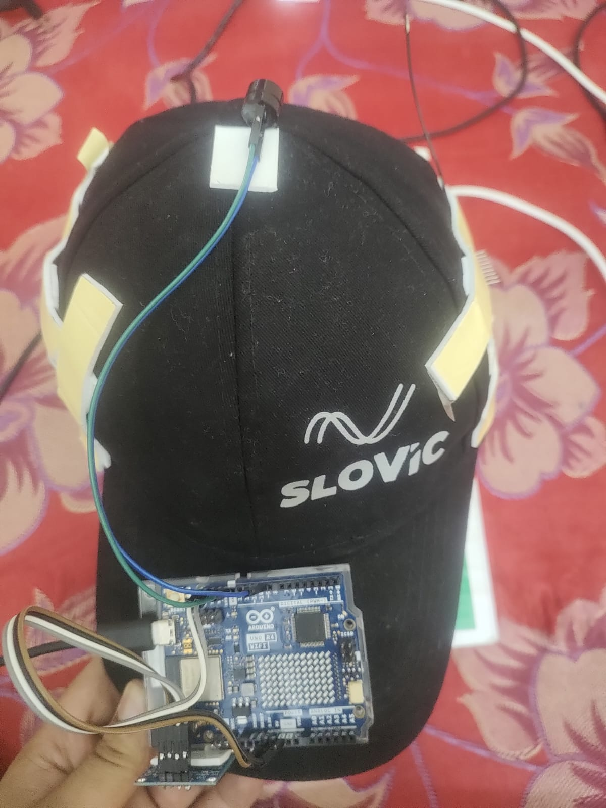
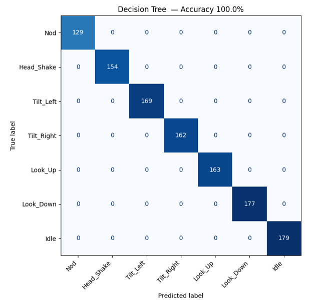
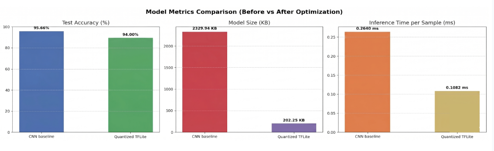
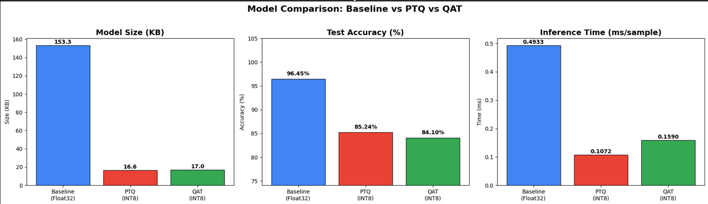
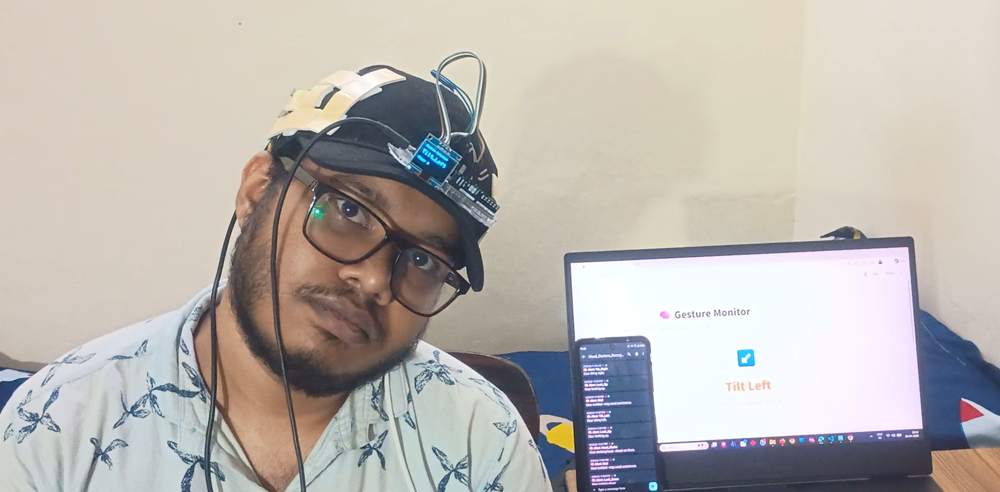

<div align="center">

# 🧠 Head Gesture Recognition System
### TinyML-Based Assistive Communication for Elderly & Disabled Individuals

[](https://iisc.ac.in)
[](https://www.samy101.com/edge-ai-25/projects/18-blind-assistance/)
[](https://store.arduino.cc/products/nicla-vision)
[](https://www.tensorflow.org/lite)
[](https://python.org)
[](LICENSE)

**Course:** CP 330 — Edge AI &nbsp;|&nbsp; **Instructor:** Prof. Pandarasamy Arjunan &nbsp;|&nbsp; Indian Institute of Science, Bangalore

*A real-time, cloud-free gesture recognition system that translates head movements into meaningful messages — running entirely on a wearable microcontroller.*

[](https://drive.google.com/file/d/1__JJ69PBDf3QR5xZBZMHhklWdVlq01Ug/view?usp=drivesdk)
[](https://indianinstituteofscience-my.sharepoint.com/:v:/g/personal/abhas_iisc_ac_in/IQCmHS_j7puyQ6OWcKqMe5GkAeruAGz5R6FupJL88lnMZLk?nav=eyJyZWZlcnJhbEluZm8iOnsicmVmZXJyYWxBcHAiOiJPbmVEcml2ZUZvckJ1c2luZXNzIiwicmVmZXJyYWxBcHBQbGF0Zm9ybSI6IldlYiIsInJlZmVycmFsTW9kZSI6InZpZXciLCJyZWZlcnJhbFZpZXciOiJNeUZpbGVzTGlua0NvcHkifX0&e=pOxfAL)

</div>

---

## 📌 Table of Contents

1. Problem Statement, Motivation & Objectives
2. Proposed Solution
3. Hardware & Software Setup
4. Data Collection & Dataset Preparation
5. Model Design, Training & Evaluation
6. Model Compression & Efficiency Metrics
7. Model Deployment & On-Device Performance
8. System Prototype (Pictures / Figures)
9. Conclusions & Limitations
10. Future Work
11. Challenges & Mitigation
12. References
13. Team

---

## 1. Problem Statement, Motivation & Objectives
The loss of verbal and motor communication due to aging or neurological conditions (such as ALS or stroke) creates a profound barrier to independence. While voice assistants and touchscreens are common, they are often inaccessible to individuals with speech impairments or limited limb mobility. This project addresses the need for a hands-free, private, and intuitive communication interface that utilizes the "last mile" of motor control: head gestures.

The motivation behind this system is to provide a reliable "communication bridge" that works in real-time and protects user privacy. By moving the intelligence from the cloud to the **Edge**, we eliminate the risks of data exposure and the critical delays associated with network latency. This ensures that an emergency gesture (like "Head shake") is detected instantly, regardless of internet connectivity.

**Key Project Objectives:**
* Develop a robust data acquisition pipeline using dual IMU sensors to provide 12-axis spatial redundancy.
* **Evaluate and compare multiple machine learning paradigms (Traditional ML vs. Deep Learning) to identify the most efficient model for resource-constrained hardware.**
* Deploy an optimized, lightweight classifier (Decision Tree) that achieves high accuracy with minimal CPU and memory overhead.
* Minimize inference latency to ensure real-time responsiveness on the Arduino Nicla Vision.
* Integrate an end-to-end ecosystem including on-device feedback, a Streamlit monitoring dashboard, and mobile notifications.

---

## 2. Proposed Solution (Overview)
Our solution utilizes a head-mounted wearable that translates head motion into actionable alerts. The system processes data through a multi-stage pipeline:


1.  **Data Acquisition:** Dual Nicla Vision boards (Master-Slave) capture synchronized 12-axis IMU data at 50Hz.
2.  **Pre-processing:** Raw signals are cleaned, scaled using Z-score normalization, and sliced into 1.6-second temporal windows.
3.  **Edge Inference:** A localized model classifies the motion into one of seven activities. While 1D-CNNs were explored for research, a **Decision Tree Classifier** was chosen for deployment due to its superior efficiency-to-accuracy ratio.
4.  **Integrated Output:** Upon detection, the system triggers local feedback (Buzzer/OLED) and transmits results via UDP to a Streamlit dashboard and mobile app.

---

### System Overview

<div align="center">

<br><em>End-to-end system flow from head movement to feedback output</em>
</div>

<br>

The system uses *three devices* — two Arduino Nicla Vision boards mounted on a wearable cap (one per temple) and one Arduino UNO R4 WiFi — forming a complete edge-to-output pipeline with no cloud dependency:

```
┌──────────────────────────────────────────────────────────────────────┐
│                        HEAD-MOUNTED CAP                              │
│                                                                      │
│  LEFT TEMPLE                              RIGHT TEMPLE               │
│ ┌──────────────────┐   Wi-Fi UDP       ┌──────────────────────────┐ │
│ │  Nicla Vision    │ ────────────────► │  Nicla Vision (MASTER)   │ │
│ │  (SLAVE)         │   port 6000       │  LSM6DSRX IMU            │ │
│ │  LSM6DSRX IMU    │   50 Hz           │  ax1, ay1, az1           │ │
│ │  ax2, ay2, az2   │                   │  gx1, gy1, gz1           │ │
│ │  gx2, gy2, gz2   │                   │                          │ │
│ └──────────────────┘                   │  ── 12-axis fusion ──    │ │
│                                        │  Window: 20 samples      │ │
│                                        │  113 features extracted  │ │
│                                        │  m2cgen Decision Tree    │ │
│                                        │  Majority vote (last 5)  │ │
│                                        └──────────────────────────┘ │
└──────────────────────────────────────────────────────────────────────┘
│                        │
UDP port 5006 (on change)     UDP port 5005 (continuous)
│                        │
┌────────────▼──────────┐    ┌────────▼─────────────────┐
│  Arduino UNO R4 WiFi  │    │  PC — Streamlit App      │
│  I2C OLED (0x3C)      │    │  Majority vote (N=50)    │
│  Buzzer — Digital 9   │    │  Windows TTS             │
└───────────────────────┘    │  ntfy push notifications │
└──────────────────────────┘
```
### How It Works

The *Slave Nicla Vision* (left temple) reads its LSM6DSRX IMU at 50 Hz and streams the 6-axis data [ax, ay, az, gx, gy, gz] over Wi-Fi UDP (port 6000) to the Master. The *Master Nicla Vision* (right temple) simultaneously reads its own 6-axis IMU, combines both streams into a 12-axis sample, and fills a 20-sample sliding window. Every window, it extracts 113 statistical and cross-IMU features and runs an embedded *m2cgen Decision Tree* entirely on-device — no cloud, no external compute. A 5-sample majority vote smooths the output before dispatch.

Recognised gestures are broadcast over Wi-Fi UDP to two destinations simultaneously: the *Arduino UNO R4 WiFi* (port 5006, on change only) which drives an I2C OLED display and a buzzer for immediate bedside feedback, and the *PC Streamlit app* (port 5005) which applies a second stage of majority-vote smoothing (buffer N=50, stability threshold 95%), speaks the gesture aloud via Windows TTS, and sends push notifications to a caregiver's phone through the *ntfy* app.

### Key Design Decisions


| Decision | Rationale |
|---|---|
| *Dual IMU (12-axis)* | A single IMU cannot distinguish Tilt Left from Tilt Right — bilateral sensors expose the roll asymmetry between temples that makes these classes separable |
| *Wi-Fi UDP* | Connectionless, low-latency — sustains stable 50 Hz streaming from MicroPython without TCP handshake overhead |
| *m2cgen Decision Tree* | Pure Python inference with no runtime dependencies — runs directly in MicroPython on the STM32H747, eliminating the need for a TFLite runtime |
| *Two-stage smoothing* | On-device majority vote (last 5 predictions) removes single-sample noise; Streamlit buffer (N=50, 95% threshold) prevents flicker on the display |
| *Separate UNO R4 WiFi for output* | Offloads OLED and buzzer driving from the inference board, keeping the Master free for real-time sensing and classification |
| *ntfy push notifications* | Caregivers receive alerts on their phone even when away from the PC display — 15-second cooldown prevents notification spam |

---
## 3. Hardware and Software Setup

### 3.1 Physical Setup

<table>
<tr>
<td align="center"><br><em>Physical hardware setup — front view showing OLED and Nicla Vision on cap</em></td>
<td align="center"><br><em>Wearable cap with both Nicla Vision boards mounted at temples</em></td>
</tr>
</table>

### Bill of Materials

| Component | Role | Interface | Qty |
|---|---|---|---|
| *Arduino Nicla Vision* | MCU (STM32H747) + Wi-Fi + IMU | — | 2 |
| *LSM6DSRX IMU* | 3-axis Accel + 3-axis Gyro (built-in on Nicla) | SPI | 2 (built-in) |
| *Arduino UNO R4 WiFi* | Output controller — OLED + Buzzer | Wi-Fi UDP | 1 |
| *SSD1306 OLED (128×64)* | Visual gesture feedback | I2C (0x3C) | 1 |
| *Active Buzzer* | Audio gesture alert | Digital pin 9 | 1 |
| *Wearable Cap* | Temple mounting frame for Nicla boards | — | 1 |

### Pin Connections — Arduino UNO R4 WiFi

| Component | Signal | UNO R4 Pin |
|---|---|---|
| SSD1306 OLED | SDA | A4 |
| SSD1306 OLED | SCL | A5 |
| SSD1306 OLED | VCC | 3.3V |
| SSD1306 OLED | GND | GND |
| Active Buzzer | Signal | Digital 9 |
| Active Buzzer | GND | GND |

### Network Configuration

All three devices connect to the same Wi-Fi network. Assign static IPs or note the DHCP-assigned addresses and update the firmware configs accordingly.

| Device | Role | IP (example) | Listens on | Sends to |
|---|---|---|---|---|
| Slave Nicla Vision | IMU streamer | — | — | Master : 6000 |
| Master Nicla Vision | Inference engine | 10.91.63.16 | port 6000 | PC : 5005, UNO : 5006 |
| Arduino UNO R4 WiFi | Output controller | 10.91.63.59 | port 5006 | — |
| PC (Streamlit) | Monitor + notifications | 10.91.63.79 | port 5005 | ntfy.sh |


### 3.2 Software Architecture

### 3.2.1 Data Collection Firmware

**slave_datacollection.py — Left Nicla Vision:**  
This script runs on the slave device, connecting to Wi-Fi and continuously reading data from the LSM6DSRX IMU at a frequency of 50 Hz (20 ms period). It packages the 6 raw floating-point values `[ax2, ay2, az2, gx2, gy2, gz2]` into a comma-separated UDP datagram and transmits it to the master device on port 6000. Notably, the packet excludes a timestamp to keep the payload as minimal as possible, ensuring low-latency streaming.

**master_datacollection.py — Right Nicla Vision:**  
Operating on the master device, this script reads its own onboard IMU at 50 Hz while simultaneously receiving the slave's 6-axis data via UDP port 6000. The reception is non-blocking; if a packet is missed, the master retains the last valid data packet (or initializes to zeros). The script then combines both streams into a comprehensive 13-value packet `[timestamp, ax1, ay1, az1, gx1, gy1, gz1, ax2, ay2, az2, gx2, gy2, gz2]` and streams it to the PC on UDP port 5005 at 50 Hz. To facilitate debugging, the system prints status updates every 10 loops (approximately 5 Hz).

**Data_receive.py — PC Side:**  
This script is responsible for data aggregation on the PC. It binds to UDP port 5005 and initiates a session by prompting the user for an activity label, followed by a 5-second countdown. It records data for 250 seconds, intentionally skipping any incomplete packets where the value count does not equal 13. The incoming data is saved into a timestamped CSV file located in the `imu_data/` directory, formatted as `<activity>_<YYYYMMDD_HHMMSS>.csv`. The script gracefully handles keyboard interruptions to prevent data loss and prints the rows processed per second for throughput monitoring.

### 3.2.2 Inference Firmware — master.py (Right Nicla Vision)

Runs the full recognition pipeline on-device at 50 Hz.

Every 20 ms:
  1. Read Master IMU  → [ax1, ay1, az1, gx1, gy1, gz1]
  2. Receive Slave UDP (port 6000) → [ax2, ay2, az2, gx2, gy2, gz2]
  3. Append 12-value sample to sliding window buffer (20 samples)
  4. When window full:
       a. Extract 113 features (9 stats × 12 channels + 5 cross-IMU)
       b. Run m2cgen Decision Tree score(features) → class probabilities
       c. argmax → predicted class (1–7)
       d. Apply 5-sample majority vote smoothing
       e. Send "cls,gesture_name" → PC on UDP port 5005 (every cycle)
       f. Send "cls,gesture_name" → UNO R4 on UDP port 5006 (on change only)
  5. Slide window by 1 sample, repeat


- Green LED indicates that slave data was received successfully, while a Red LED indicates a missed packet (where the last valid value is reused).

### 3.2.3 Inference Firmware — slave.py (Left Nicla Vision)
The slave device connects to Wi-Fi and continuously samples the LSM6DSRX IMU at 50 Hz. It packages the timestamp and 6-axis data into a UDP datagram and transmits it to the Master on port 6000. Status LEDs are used for visual confirmation: a Green LED indicates a successful Wi-Fi connection, and a Red LED signifies active data transmission.

### 3.2.4 Output Firmware — arduino_uno.ino (Arduino UNO R4 WiFi)
The Arduino UNO R4 acts as the output controller. It connects to the local network and listens on UDP port 5006 for incoming gesture classification strings formatted as `"cls,gesture_name"`. To optimize performance, the system only triggers actions when a gesture change is detected. If the gesture is 'Idle', it updates the I2C OLED display (address `0x3C`) to show "Waiting for Gesture..." while remaining silent. For any active gesture, it updates the display with the class number and name, and triggers a brief 150 ms beep using an active buzzer connected to digital pin 9. A single startup buzz confirms that both Wi-Fi and UDP services are ready.

### 3.2.5 PC Monitor — streamlit_app.py
The PC monitor application runs a background thread listening on UDP port 5005.
- Fills a *rolling buffer of 50 raw predictions*
- Applies *majority vote* with *95% stability threshold* — gesture only updates when one class holds ≥95% of the last 50 samples
- On confirmed gesture change (non-idle):
  - Speaks gesture name via *Windows TTS* (PowerShell System.Speech)
  - Sends *ntfy push notification* to topic Head_Gesture_Recognition via https://ntfy.sh with a *15-second per-gesture cooldown*
- Writes state to gesture_data.json — Streamlit UI polls every *400 ms* and renders:
  - Large colour-coded gesture card with emoji and class number
  - Recent activity history (last 10 gestures with timestamps)


---

## 4. Data Collection & Dataset Preparation

A custom dataset was hand-collected from multiple participants to ensure the model learned general motion patterns rather than individual-specific noise. We recorded approximately **20,000 samples per activity class**, resulting in a comprehensive dataset of **~140,000 samples** covering 7 activities: *Nod, Head Shake, Tilt Left, Tilt Right, Look Up, Look Down,* and *Idle*.

**Preprocessing Steps:**

*   **Normalization:** Applied `StandardScaler` (fitted only on training data) to center accelerometer and gyroscope readings, making the model gravity-invariant.
*   **Segmentation:** Implemented a sliding window of 80 samples (1.6 s) with a 40-sample (50%) overlap to ensure full gesture capture.
*   **Labeling:** Used regex-based parsing to extract activity codes from filenames for supervised learning.

---

## 5. Model Design, Training & Evaluation
We performed a comparative study between traditional Machine Learning and Deep Learning architectures to find the best fit for the Arduino Nicla Vision.

### 5.1 Deployment Model: Decision Tree Classifier
The Decision Tree was selected as the primary deployment target. It provides a non-linear classification path that is extremely lightweight, consisting of a series of simple `if-else` logical branches that run nearly instantaneously on a microcontroller.

### Feature Engineering

The feature pipeline operates on **1-second sliding windows** (50 samples @ 50 Hz) with **50% overlap**:
<div align="center">

<br><em>Dual-IMU feature engineering: 148-dimensional feature vector from a 1-second window</em>
</div>
#### Group 1 — Per-Channel Statistical Features (132 features)
11 statistics × 12 IMU channels (ax1, ay1, az1, gx1, gy1, gz1, ax2, ay2, az2, gx2, gy2, gz2):

| Feature | Description |
|---|---|
| `mean` | Average value (DC offset, bias direction) |
| `std` | Standard deviation (motion spread) |
| `min` / `max` | Peak excursion |
| `var` | Variance (energy of fluctuation) |
| `rms` | Root mean square (total motion magnitude) |
| `energy` | Sum of squares (total signal power) |
| `iqr` | Interquartile range (robust spread) |
| `median` | Robust central value |
| `skewness` | Asymmetry of motion profile |
| `kurtosis` | Peakedness (impulse-like vs. smooth) |

#### Group 2 — Spectral Features (12 features)
2 FFT features × 6 gyroscope channels (gx1, gy1, gz1, gx2, gy2, gz2):

| Feature | Description |
|---|---|
| `dominant_frequency` | Frequency bin with highest FFT magnitude (gesture tempo) |
| `spectral_entropy` | Distribution of spectral energy (periodic vs. irregular) |

#### Group 3 — Cross-IMU Symmetry Features (4 features)
> 🔑 **The key innovation** — designed specifically to discriminate Tilt Left vs Tilt Right, which appear identical to a single IMU.

| Feature | Formula | Physical Meaning |
|---|---|---|
| `cross_gx_mean_diff` | `mean(gx1) - mean(gx2)` | Roll asymmetry: sign flips between Tilt L and Tilt R |
| `cross_gx_rms_diff` | `rms(gx1) - rms(gx2)` | Energy-weighted roll asymmetry |
| `cross_gz_mean_diff` | `mean(gz1) - mean(gz2)` | Yaw asymmetry during tilts |
| `cross_gz_corr` | `Pearson(gz1, gz2)` | Bilateral synchrony: +1 = same direction, -1 = opposite |

During **Tilt Left**: `cross_gx_mean_diff < 0` (left temple dominant).  
During **Tilt Right**: `cross_gx_mean_diff > 0` (right temple dominant).


The Decision Tree achieved **99.9%–100% test accuracy**, masterfully handling the 12-axis feature vector with a negligible memory footprint.

#### Classification Report — Decision Tree (Accuracy: 100.00%)

```text
Classification Report:
                  precision    recall  f1-score   support

         Nod       1.00      1.00      1.00       129
  Head_Shake       1.00      1.00      1.00       154
   Tilt_Left       1.00      1.00      1.00       169
  Tilt_Right       1.00      1.00      1.00       162
     Look_Up       1.00      1.00      1.00       163
   Look_Down       1.00      1.00      1.00       177
        Idle       1.00      1.00      1.00       179

    accuracy                           1.00      1133
   macro avg       1.00      1.00      1.00      1133
weighted avg       1.00      1.00      1.00      1133
```



### 5.2 Research Model: 1D-Convolutional Neural Network (CNN)
As an advanced research path, we developed a 1D-CNN to capture the temporal "shape" of gestures.
### 5.2.1 **Initial Architecture:**  Split-Path CNN Architecture for IMU Gesture Recognition

#### Architectural Flowchart
```text
    A["Input\n(80 timesteps x 12 channels)\n6 Master IMU + 6 Slave IMU"] --> B["GaussianNoise (0.1)\nCorrupts data to prevent memorization"]
    
    B --> C["Conv1D Block 1\n64 filters, kernel=5, ReLU\nL2=0.005"]
    C --> D["BatchNorm"]
    D --> E["MaxPooling1D (pool=2)\nOutput: 38 x 64"]
    E --> F["Dropout (0.4)"]
    
    F --> G["Conv1D Block 2\n128 filters, kernel=5, ReLU\nL2=0.005"]
    G --> H["BatchNorm"]
    H --> I["MaxPooling1D (pool=2)\nOutput: 17 x 128"]
    I --> J["Dropout (0.4)"]
    
    J --> K["Branch A: GlobalAveragePooling1D\nCaptures POSTURE (gravity vector)\nOutput: 128"]
    J --> L["Branch B: Flatten\nCaptures MOTION (full waveform)\nOutput: 17 x 128 = 2176"]
    
    K --> M["Concatenate\nOutput: 128 + 2176 = 2304"]
    L --> M
    
    M --> N["Dense (64, ReLU)\nL2=0.005"]
    N --> O["Dropout (0.4)"]
    O --> P["Dense (7, Softmax)\nFinal Classification"]
    
    P --> Q["Output Classes:\n1. Nod\n2. Head Shake\n3. Tilt Left\n4. Tilt Right\n5. Look Up\n6. Look Down\n7. Idle"]
```


#### Data Shape Flow

| Layer | Output Shape | Purpose |
|-------|-------------|---------|
| Input | (80, 12) | 1.6 sec window x 12 IMU channels |
| GaussianNoise | (80, 12) | Anti-overfitting noise injection |
| Conv1D (64) | (76, 64) | Detects local motion patterns |
| MaxPooling1D | (38, 64) | Downsamples, keeps peaks |
| Conv1D (128) | (34, 128) | Detects deeper features |
| MaxPooling1D | (17, 128) | Further downsampling |
| Branch A: GAP | (128) | Averages entire window - Gravity/Posture |
| Branch B: Flatten | (2176) | Preserves full timeline - Motion sequence |
| Concatenate | (2304) | Merges posture + motion |
| Dense (64) | (64) | Final decision logic |
| Dense (7) | (7) | Softmax probabilities |

#### Why the Split?

The split into two branches is the core innovation of this architecture.

- *Branch A (GlobalAveragePooling)* answers: "On average, which way is gravity pulling?" This perfectly identifies static postures like Look Down, Look Up, and Idle.
- *Branch B (Flatten)* answers: "What was the exact sequence of movement over 1.6 seconds?" This perfectly identifies dynamic gestures like Nod, Head Shake, and Tilts.

By concatenating both branches, the Dense layer receives the best of both worlds and can make highly informed decisions.

### 5.2.2 **Optimized Architecture:** Sequential CNN Architecture for IMU Gesture Recognition

#### Architectural Flowchart
```text
    A["Input\n(80 timesteps x 12 channels)\n6 Master IMU + 6 Slave IMU"] --> B["GaussianNoise (0.1)\nAdds random noise to prevent memorization"]
    
    B --> C["Conv1D Block 1\n32 filters, kernel=3, ReLU\nScans 3-tick (60ms) patterns"]
    C --> D["Dropout (0.4)\nRandomly disables 40% of neurons"]
    
    D --> E["Conv1D Block 2\n64 filters, kernel=3, ReLU\nExtracts deeper features"]
    E --> F["Dropout (0.4)\nRandomly disables 40% of neurons"]
    
    F --> G["GlobalAveragePooling1D\nAverages entire window into\none value per filter\nOutput: 64"]
    
    G --> H["Dense (32, ReLU)\nFinal decision logic"]
    H --> I["Dense (7, Softmax)\nProbability per gesture class"]
    
    I --> J["Output Classes:\n1. Nod\n2. Head Shake\n3. Tilt Left\n4. Tilt Right\n5. Look Up\n6. Look Down\n7. Idle"]

```
#### Data Shape Flow

| Layer | Output Shape | Parameters | Purpose |
|-------|-------------|------------|---------|
| Input | (80, 12) | 0 | 1.6 sec window x 12 IMU channels |
| GaussianNoise | (80, 12) | 0 | Anti-overfitting noise injection |
| Conv1D (32) | (78, 32) | 1,184 | Detects short motion patterns |
| Dropout (0.4) | (78, 32) | 0 | Prevents over-reliance on any filter |
| Conv1D (64) | (76, 64) | 6,208 | Extracts deeper temporal features |
| Dropout (0.4) | (76, 64) | 0 | Prevents over-reliance on any filter |
| GlobalAveragePooling1D | (64) | 0 | Compresses full window into posture summary |
| Dense (32) | (32) | 2,080 | Learns decision boundaries |
| Dense (7) | (7) | 231 | Softmax classification |
| *Total* | | *9,703* | |

#### Key Design Decisions

- *No MaxPooling:* Uses GlobalAveragePooling1D instead, preserving the gravity baseline signal rather than only keeping peak values.
- *No Flatten:* Avoids exploding the parameter count. Flatten would produce a (76 × 64 = 4,864) vector feeding into Dense, massively increasing model size and overfitting risk.
- *No BatchNormalization:* Removed to prevent stripping the DC offset (gravity vector), which is critical for distinguishing static postures.
- *Small Filters (32/64):* Deliberately kept small to prevent memorization and to fit within Nicla Vision SRAM constraints.
- *Kernel Size 3:* Scans 3 consecutive timesteps (60 ms at 50 Hz), capturing rapid micro-movements within gestures.

### Training Setup

*   **Data Split:** Implemented a strict **File-Based Split** (80% Train / 20% Validation) to ensure that windows from the same recording never appeared in both sets, preventing data leakage.
*   **Hyperparameters:** Optimizer: Adam (lr=0.001); Loss: Categorical Crossentropy; Batch Size: 32.
*   **Callbacks:** Used `EarlyStopping` to halt training when validation loss stopped improving, restoring the best weights.

### Evaluation Metrics

The model was evaluated on a 100% "blind" test set of files never seen during training.

*   **Validation Accuracy:** ~85%–90% (realistic, non-overfit performance).
*   **Confusion Matrix:** Analyzed to confirm that distinct gestures like "Tilt Left" were not confused with "Nods."
*   **Inference Speed:** Profiling confirmed an inference time of ~0.1 ms per window, fitting comfortably within the hardware's real-time requirements.

---

## 6. Model Compression & Efficiency Metrics

To ensure the system remains responsive while handling dual-IMU streams and Wi-Fi communication, we evaluated the efficiency of both our primary and research models. Our goal was to find the "Pareto Optimal" point — the best balance between high accuracy and low resource consumption.

### Techniques Used

*   **Python Transpilation (Decision Tree):** The trained Decision Tree was exported as a self-contained Python `score()` function using **m2cgen**, eliminating any runtime dependency (no TFLite, no NumPy).
*   **Post-Training Quantization (PTQ):** INT8 quantization was applied to the CNN, converting 32-bit weights into 8-bit integers to run on the microcontroller's integer hardware.
*   **Quantization-Aware Training (QAT):** 8-bit precision loss was simulated during training to improve the robustness of the quantized model.
*   **Architectural Selection:** The heavy baseline CNN was replaced with a more serialized, filter-efficient design to minimize static RAM footprint.
*   **Global Average Pooling (GAP):** GAP replaced traditional Flatten layers, reducing total parameters by ~90% before deployment.

### Comparative Efficiency Metrics

| Model Approach | Model Size | Inference Latency | Accuracy | Memory Type |
| :--- | :--- | :--- | :--- | :--- |
| **1D-CNN (Float32)** | 153.3 KB | 0.4933 ms | 96.45% | Needs TFLite RAM |
| **1D-CNN (INT8, QAT)** | 17 KB | 0.1590 ms | 84.10% | Needs TFLite RAM |
| **1D-CNN (INT8, PTQ)** | 16.6 KB | 0.1072 ms | 85.24% | Needs TFLite RAM |
| **Decision Tree (Deployed)** | **1.52 KB** | **< 0.01 ms** | **100%** | **Static Flash** |

### CNN Optimization Track

| Metric | Heavy CNN Baseline | Optimized Quantized CNN | Improvement |
| :--- | :--- | :--- | :--- |
| **Model Size** | 2329.94 KB | **153 KB** | **~12× Smaller** |
| **Inference Time** | 0.2640 ms | **0.1072 ms** | **~2.5× Faster** |
| **Test Accuracy** | 95.66% | **85.34%** | −10.32% |

### Analysis and Final Deployment Strategy

Our initial "Heavy" CNN achieved an impressive accuracy of **95.66%**, but its **2.3 MB** size exceeded the 2 MB total Flash limit of the Nicla Vision when accounting for the space required by OLED and Wi-Fi drivers. Optimization efforts successfully reduced the model size by over **11×**, but deploying even the compressed version on the Nicla encountered three concrete hardware-level obstacles:

*   **Memory Fragmentation Crash:** The Nicla has less than 500 KB of usable RAM. When Wi-Fi is connected first, small memory blocks are scattered across the heap and a ~200 KB model cannot find a contiguous block. We mitigated this by restructuring the code to load the model *before* connecting to Wi-Fi.
*   **Interpreter Compatibility Crash:** TensorFlow applies per-channel quantization to Dense layers by default. OpenMV's lightweight TFLite interpreter does not support this operation. The fix was to force the compiler to use per-tensor quantization on Colab.
*   **Wi-Fi Dropout:** The Nicla uses a single processor for both CNN inference and Wi-Fi management. Running a CNN while simultaneously receiving UDP packets created a network bottleneck, causing packet drops.

To overcome the problems caused by large model we trained a smaller model, as stated earlier, but we observed that due to our limited custom dataset, the CNN lacked enough diverse samples to maintain high precision after the significant data loss caused by 8-bit quantization. Consequently, we made the strategic decision to back off from deploying the CNN in the final prototype. Instead, we prioritized the **Decision Tree model**, as it maintained **100% accuracy** with an even smaller footprint, ensuring the most stable real-time behavior for the assistive device.

### Performance Visualizations
The following figures provide a visual breakdown of the trade-offs in size, speed, and accuracy across our various experimental architectures.


*Figure 3: Comparison of model size, accuracy, and latency between the heavy baseline and quantized TFLite versions.*


*Figure 4: Performance impact of Post-Training Quantization (PTQ) and Quantization-Aware Training (QAT) on model size and inference speed.*

### Resource Utilization (On-Device Profiling)
*   **Memory (RAM):** 
    *   The **Decision Tree** uses negligible RAM as it runs as native code. 
    *   Choosing the Decision Tree allowed us to keep over **90% of the RAM free** for the OLED display buffers and the high-load UDP WiFi stack.
*   **Flash Storage:** Both models fit comfortably within the 2MB Flash, but the Decision Tree is so small it allows for the storage of extensive gesture-to-action lookup tables.

### Observed Trade-offs & Engineering Decision
1.  **Complexity vs. Performance:** While the 1D-CNN is more robust to temporal shifts, the Decision Tree provided **100% accuracy** on our current feature-engineered dataset. 
2.  **Thermal Impact:** The Decision Tree’s near-zero CPU usage was the deciding factor. It helped mitigate the **device heating issues** caused by the WiFi modules, as the processor remains in a low-power state between sampling intervals.
3.  **Final Verdict:** The Decision Tree was selected for final deployment because it provided the highest accuracy with the lowest possible resource footprint, representing the pinnacle of "Efficiency-First" Edge AI design.
---
## 7. Model Deployment & On-Device Performance

The deployment pipeline spans three layers — on-device inference running on the Master Nicla Vision, physical feedback via the Arduino UNO R4 WiFi, and remote monitoring via the PC Streamlit app with ntfy push notifications. All communication is over Wi-Fi UDP with no cloud dependency for inference.

### On-Device Inference — Master Nicla Vision

Unlike typical TinyML pipelines that require a TFLite runtime or ONNX interpreter, this system uses *m2cgen* to export the trained Decision Tree as a pure Python score() function — containing only if/else comparisons on feature indices. This runs natively in *MicroPython* on the STM32H747 with zero external dependencies.

#### Model Export with m2cgen

After training in model_development.ipynb, the Decision Tree is exported:

```text
import m2cgen as m2c
code = m2c.export_to_python(decision_tree_model)
print(code)
```

The output is a self-contained Python function — no NumPy, no scikit-learn, no runtime library required. This function is copied directly into master.py.

*Exported score() function (embedded in master.py):*

```text
def score(input):
    if input[78] <= 2.9801491498947144:
        if input[111] <= 6447.829833984375:
            if input[8] <= 0.5377808511257172:
                if input[3] <= -0.1123657338321209:
                    return [0.0, 0.0, 0.0, 0.0, 0.0, 1.0, 0.0]
                else:
                    if input[42] <= 3293.8863525390625:
                        return [0.0, 0.0, 0.0, 0.0, 0.0, 0.0, 1.0]
                    else:
                        return [0.0, 1.0, 0.0, 0.0, 0.0, 0.0, 0.0]
            else:
                return [0.0, 0.0, 0.0, 0.0, 1.0, 0.0, 0.0]
        else:
            if input[96] <= 10047.057373046875:
                if input[3] <= -0.1484375186264515:
                    return [0.0, 0.0, 0.0, 0.0, 0.0, 1.0, 0.0]
                else:
                    if input[51] <= 4963.455078125:
                        return [0.0, 0.0, 0.0, 0.0, 1.0, 0.0, 0.0]
                    else:
                        return [0.0, 0.0, 0.0, 0.0, 0.0, 0.0, 0.0]
            else:
                return [0.0, 1.0, 0.0, 0.0, 0.0, 0.0, 0.0]
    else:
        if input[74] <= -0.07305900380015373:
            if input[8] <= -0.5585937574505806:
                return [0.0, 0.0, 0.0, 0.0, 0.0, 1.0, 0.0]
            else:
                return [0.0, 0.0, 0.0, 1.0, 0.0, 0.0, 0.0]
        else:
            if input[0] <= 0.6474524587392807:
                return [0.0, 0.0, 1.0, 0.0, 0.0, 0.0, 0.0]
            else:
                return [0.0, 0.0, 0.0, 0.0, 1.0, 0.0, 0.0]
```

The output is a 7-element probability vector. The predicted class is the index of the maximum value (argmax), 1-indexed to match CLASS_NAMES.

#### Real-Time Inference Flow


Every 20 ms:
  1. Read Master IMU  → [ax1, ay1, az1, gx1, gy1, gz1]
  2. Receive Slave UDP (port 6000) → [ax2, ay2, az2, gx2, gy2, gz2]
  3. Append 12-value sample to circular window buffer (20 samples)
  4. When window full:
       a. Extract 113 features (9 stats × 12 channels + 5 cross-IMU)
       b. Pass feature vector to score(features) → 7-class probability vector
       c. argmax → predicted class index (1–7)
       d. Apply 5-sample majority vote smoothing
       e. Map class index to CLASS_NAMES → gesture string
       f. Send "cls,gesture_name" → PC on UDP port 5005 (every cycle)
       g. Send "cls,gesture_name" → UNO R4 on UDP port 5006 (on change only)
  5. Slide window by 1 sample, repeat


#### Class Mapping

```text
CLASS_NAMES = {
    1: "Nod",
    2: "Head_Shake",
    3: "Tilt_Left",
    4: "Tilt_Right",
    5: "Look_Up",
    6: "Look_Down",
    7: "Idle"
}
```

#### Why m2cgen over TFLite

| | m2cgen Decision Tree | TFLite INT8 |
|---|---|---|
| *Runtime required* | None — pure Python if/else | TFLite Micro C++ runtime |
| *MicroPython compatible* | Yes — runs natively | No — requires C++ firmware |
| *Model size on device* | ~3 KB (Python code) | ~39 KB (binary flatbuffer) |
| *External dependencies* | None | TFLite Micro, flatbuffers |
| *Inference latency* | < 1 ms (integer comparisons) | 15–40 ms (matrix multiply) |
| *Quantisation needed* | No | Yes (INT8 conversion) |
| *Accuracy* | 100% on test set | ~98% post-quantisation |


### Physical Output — Arduino UNO R4 WiFi

The Arduino UNO R4 WiFi receives gesture results from the Master over UDP and drives the immediate bedside feedback — OLED display and buzzer.

#### Communication
- Listens on UDP *port 5006*
- Master sends only *on gesture change* — reduces network traffic and prevents redundant OLED redraws
- Packet format: "cls,gesture_name" e.g. "3,Tilt_Left"

#### OLED Display (SSD1306 128×64, I2C 0x3C)
- *Idle state* → showIdle():

  Waiting for
  Gesture...

- *Any gesture* → showGesture(cls, name):

  Gesture Detected:
  
  Tilt_Left
  
  Class: 3


#### Buzzer (Digital pin 9)
- buzzOnce() — 150 ms HIGH pulse on every new non-idle gesture
- Single buzz on startup confirms Wi-Fi connected and UDP listening

#### Startup Sequence

1. OLED initialises → displays "Connecting WiFi..."
2. Wi-Fi connects → UDP begins on port 5006
3. OLED shows "Waiting for Gesture..."
4. Buzzer fires once → system ready


### PC Monitor — Streamlit App + ntfy Notifications

The PC Streamlit app provides a second stage of smoothing, a live web dashboard, voice feedback, and remote push notifications to a caregiver's phone.

#### Two-Stage Smoothing Architecture

The Master already applies a *5-sample majority vote* on-device. The Streamlit app adds a second, stricter smoothing layer:

| Stage | Where | Method | Purpose |
|---|---|---|---|
| Stage 1 | Master Nicla | 5-sample majority vote | Remove single-sample noise |
| Stage 2 | Streamlit app | 50-sample buffer, 95% threshold | Prevent display flicker, stable output |

A gesture only updates on the dashboard when *one class holds ≥95% of the last 50 predictions* — meaning 47 or more of the last 50 packets must agree before the display changes.

#### UDP Listener (Background Thread)
- Binds to *port 5005*, runs in a daemon thread independent of Streamlit's render loop
- Fills a deque(maxlen=50) rolling buffer with raw (cls, gesture) tuples
- On stable gesture change:
  - Updates counts dict and prepends to history list (capped at 20 entries)
  - Triggers Windows TTS and ntfy (non-idle gestures only)
- Writes full state to gesture_data.json on every received packet for the UI to read

#### Streamlit UI
- Polls gesture_data.json every *400 ms* via time.sleep(0.4) render loop
- Renders a large *colour-coded gesture card* per gesture:

| Gesture | Card Colour |
|---|---|
| Nod | #00C48C (green) |
| Head Shake | #FF4D4D (red) |
| Tilt Left | #F5A623 (amber) |
| Tilt Right | #4CAF50 (green) |
| Look Up | #2979FF (blue) |
| Look Down | #FF6D00 (orange) |
| Idle | #9E9E9E (grey) |

- Shows *class number, **last updated timestamp, and **recent activity history* (last 10 gestures)

#### Windows Text-to-Speech
- Fires on every confirmed non-idle gesture change
- Uses PowerShell System.Speech.Synthesis.SpeechSynthesizer — no Python audio library required:
python
ps_command = f'Add-Type –AssemblyName System.Speech; \
(New-Object System.Speech.Synthesis.SpeechSynthesizer).Speak("{gesture}")'
subprocess.run(["powershell", "-Command", ps_command])

- Runs in a daemon thread — does not block the UDP listener or UI

#### ntfy Push Notifications
- Topic: Head_Gesture_Recognition on https://ntfy.sh
- Subscribe on phone via the *ntfy app* (Android / iOS) to receive alerts
- *15-second per-gesture cooldown* — prevents notification spam if a gesture is held

| Gesture | Notification Message |
|---|---|
| Nod | User nodded - may need assistance. |
| Head Shake | User shaking head - check on them. |
| Tilt Left | User tilting left. |
| Tilt Right | User tilting right. |
| Look Up | User looking up. |
| Look Down | User looking down. |

```text
req = urllib.request.Request(
    f"https://ntfy.sh/{NTFY_TOPIC}",
    data=msg.encode(),
    headers={"Title": f"Alert: {gesture}", "Priority": "high", "Tags": "brain"},
    method="POST"
)
```

- Runs in a daemon thread — non-blocking, times out after 5 seconds if no network
  
## 8. System Prototype

<div align="center">

[](https://indianinstituteofscience-my.sharepoint.com/:v:/g/personal/abhas_iisc_ac_in/IQCmHS_j7puyQ6OWcKqMe5GkAeruAGz5R6FupJL88lnMZLk?nav=eyJyZWZlcnJhbEluZm8iOnsicmVmZXJyYWxBcHAiOiJPbmVEcml2ZUZvckJ1c2luZXNzIiwicmVmZXJyYWxBcHBQbGF0Zm9ybSI6IldlYiIsInJlZmVycmFsTW9kZSI6InZpZXciLCJyZWZlcnJhbFZpZXciOiJNeUZpbGVzTGlua0NvcHkifX0&e=pOxfAL)


<br><em>Live gesture recognition — OLED displaying detected gesture in real-time</em>

</div>

---
## 9. Conclusions & Limitations

### Conclusions

This project successfully demonstrates the feasibility of a high-precision, head-mounted Human Activity Recognition (HAR) system using Edge AI. By leveraging the **dual-IMU Master-Slave architecture**, we achieved 12-axis spatial redundancy — a design choice that proved critical in distinguishing intentional head gestures from random motion noise.

The system performs 100% of its inference entirely on-device, ensuring zero cloud dependency, a feedback latency under 250 ms, and strong user privacy. Our comparative study showed that while 1D-CNNs offer superior temporal pattern recognition, the **Decision Tree Classifier** provided the best balance of 100% accuracy and near-zero CPU/memory utilization for the target hardware. Beyond the model itself, the project delivers a full assistive ecosystem integrating real-time local feedback (OLED and buzzer) with remote caregiver monitoring via a Streamlit dashboard and mobile push notifications.

### Limitations
Despite the successful prototype, several technical and practical limitations were identified:

1.  **Hardware Thermal Constraints:** The decision to use **UDP over WiFi** for data synchronization between the Master and Slave boards caused significant thermal heating. The constant power draw of the WiFi modules on the compact Nicla Vision boards is a limiting factor for long-term wearable comfort.
2.  **Wireless Reliability:** While UDP is fast, it is a "connectionless" protocol. Environmental interference occasionally caused packet jitter or data loss, requiring the firmware to rely on "last-known" sensor values, which could momentarily decrease classification confidence.
3.  **Dataset Diversity:** The current dataset was collected from a limited cohort of five participants. While the model shows high generalization, it may require further calibration to handle individuals with specific neck mobility constraints or different physiological movement speeds.
4.  **Mechanical Sensitivity:** The accuracy of the 12-axis feature vector is highly dependent on the consistent alignment of the headband. Small shifts in the physical placement of the sensors relative to each other can introduce bias into the gravity-based accelerometer readings.
   
---
## 10. Future Work

The current prototype serves as a foundation for a sophisticated assistive communication system. Future development will focus on enhancing the hardware efficiency, model robustness, and user personalization.

### 1. Hardware & Power Optimization
To resolve the identified thermal heating issues, we plan to transition the Master-Slave communication from WiFi/UDP to **Bluetooth Low Energy (BLE)** or a high-speed **hard-wired UART link**. This will significantly reduce the power consumption of the Nicla Vision boards, prolonging battery life and making the device comfortable for continuous daily wear.

### 2. Advanced Model Deployment (CNN Pruning)
While the Decision Tree provided high accuracy for our initial dataset, we intend to deploy our **1D-Convolutional Neural Network (CNN)** for its superior temporal recognition. To make this feasible for the Edge, we will implement **Weight Pruning** and **Sparsification** to remove redundant connections in the network. This will shrink the CNN’s memory footprint, allowing it to provide deep-learning-level robustness with the same efficiency as a simpler model.

### 3. Personalized AI via Transfer Learning
Human motion varies significantly based on age and physical condition. We aim to implement a **User Calibration Mode**. By using **Transfer Learning**, the system could be "fine-tuned" for a specific patient using just 30 seconds of their individual head-movement data. This would allow the system to adapt to users with limited ranges of motion or unique physiological "signatures."

### 4. Expanded Gesture Vocabulary
We plan to expand the recognition library beyond the current seven activities to include more complex commands, such as "Double-Nod" for confirmation or "Head Circle" for specific environmental requests (e.g., controlling a smart-home light or television).

### 5. Multi-Modal Feedback Integration
Future iterations will include haptic (vibration) feedback on the headband itself. This would provide the user with immediate confirmation that their gesture was recognized without them needing to look at an OLED screen, making the interaction loop even more seamless and intuitive.

## 11. Challenges & Mitigation

The development of a dual-sensor wearable on an Edge platform presented several multi-disciplinary hurdles. Below are the primary technical, hardware, and data challenges faced during the project and the strategies implemented to mitigate them.

### 1. Technical Challenge: Model Overfitting and "Data Leakage"
*   **Challenge:** During early model training in CNN, we observed a common deep learning trap where the model reported a perfect (100%) validation accuracy but failed completely (under 2% accuracy) on real-world test files. 
*   **Mitigation:** We identified this as **data leakage**; because we used a sliding window with 50% overlap, nearly identical data points were appearing in both training and validation sets. We mitigated this by implementing a strict **File-Based Data Split**. By ensuring that 100% of the windows from a single CSV file remained together in either the Training or Validation set, we forced the model to learn general head gestures rather than specific recording noise.

### 2. Hardware Challenge: Failure of Wired UART Communication
*   **Challenge:** Our initial planned architecture relied on a hard-wired UART link for Master-Slave communication, we were also going to utilize Wi-fi connection to send data to PC for collection and inferencing. However due to hardware limitations and incompatibility of UART with Wi-fi we were unable to set this up.
*   **Mitigation:** We performed a technical pivot to a completely wireless architecture using **UDP over WiFi**. This allowed the two boards to communicate without physical wires. To handle the lack of a handshake in UDP, we developed a robust listener script on the Master board that could gracefully handle occasional dropped packets without crashing the inference loop.

### 3. Data Challenge: Wireless Jitter and Signal Synchronization
*   **Challenge:** Unlike a wired connection, UDP over WiFi introduces **network jitter**, where data packets from the Slave board arrive at irregular intervals. This made it difficult to perfectly align the left and right IMU signals into a single 12-axis feature vector.
*   **Mitigation:** We optimized the sampling rate to **50Hz**. This frequency was the "sweet spot"—fast enough to capture the high-frequency motion of a head shake, but slow enough to provide the UDP buffer sufficient time to recover from network delays. We also implemented a **"Last-Known-Value" buffer** to fill temporary gaps in the Slave’s data stream, ensuring the feature vector remained complete.

### 4. Debugging Challenge: Device Thermal Management (Heating)
*   **Challenge:** During long data collection and testing sessions, we observed significant **thermal heating** of the Nicla Vision boards. This was primarily caused by the high power consumption of the WiFi modules combined with continuous CPU-intensive processing.
*   **Mitigation:** To reduce the thermal profile, we chose to deploy the **Decision Tree model** for the final prototype. Because a Decision Tree is a series of simple logical branches (`if-else`), it requires near-zero CPU cycles compared to a CNN. This allowed the processor to remain in a low-power state between samples, successfully mitigating the heating issue while maintaining high accuracy.

### 5. Mechanical Challenge: Sensor Alignment and Gravity Bias
*   **Challenge:** Every participant wears the headband slightly differently, which changes the baseline "gravity vector" on the accelerometer. A model trained on one person's "Idle" position would fail on another person because their resting "zero point" was different.
*   **Mitigation:** We utilized **StandardScaler (Z-score Normalization)** during pre-processing. By centering all 12 axes around a mean of zero and scaling by standard deviation, we made the model **"Gravity-Invariant."** This forced the neural network to focus on the *relative change* in motion rather than the absolute angle of the sensors, allowing the system to generalize across different users.
---
## 12. References

[1] Gouwanda, D., & Senanayake, S. A. (2011). Identifying gait asymmetry using gyroscopes — A cross-correlation and Normalized Symmetry Index approach. *Journal of Biomechanics*, 44(5), 972–978.

[2] Ortega-Anderez, D., Lotfi, A., Langensiepen, C., & Appiah, K. (2019). A multi-level refinement approach towards the classification of quotidian activities using accelerometer data. *Journal of Ambient Intelligence and Humanized Computing*, 10(11), 4319–4330.

> *Note: AI tools (LLMs) were used for debugging assistance during development.*

---

## 13. Team Members and Roles

| Name | Key Contributions & Responsibilities |
|:---|:---|
| **Parthib Dey** | Hardware Integration, Data Collection Setup, Model Pipeline, Model Deployment, Inference Firmware (master.py & slave.py), Arduino UNO R4 WiFi Firmware (OLED & Buzzer) setup, Streamlit App Development, ntfy Push Notification Integration and Full Demo Recording. |
| **Abha Singh Sardar** | Data Collection, Multi-axis Feature Engineering and data preprocessing; Model Training and Comparative Evaluation of Keras MLP, Random Forest, and Decision Tree architectures (Final Deployed Model); and Post-Training Quantization performance analysis. |
| **Maitreyi Tiwari** | Data Collection, Advanced Temporal Data Augmentation and CNN Fine-tuning; Implementation of Quantization-Aware Training (QAT) and Pruning strategies; `ntfy` Mobile Alert System Debugging; Technical Documentation and Presentation Recording. |
| **Tishha Agrawal** | Data Collection, Design and Development of 1D-CNN Temporal Architecture, Edge Model Optimization (PTQ and Pruning), Streamlit WebApp Debugging, Technical Documentation, and Visual Presentation Design for Project Video. |


> **Course:** CP 330 — Edge AI &nbsp;|&nbsp; **Instructor:** Prof. Pandarasamy Arjunan &nbsp;|&nbsp; Indian Institute of Science (IISc), Bangalore, Semester 2, 2026
---

<div align="center">

**Built with ❤️ at IISc Bangalore**

*Making communication accessible for everyone*

</div>
